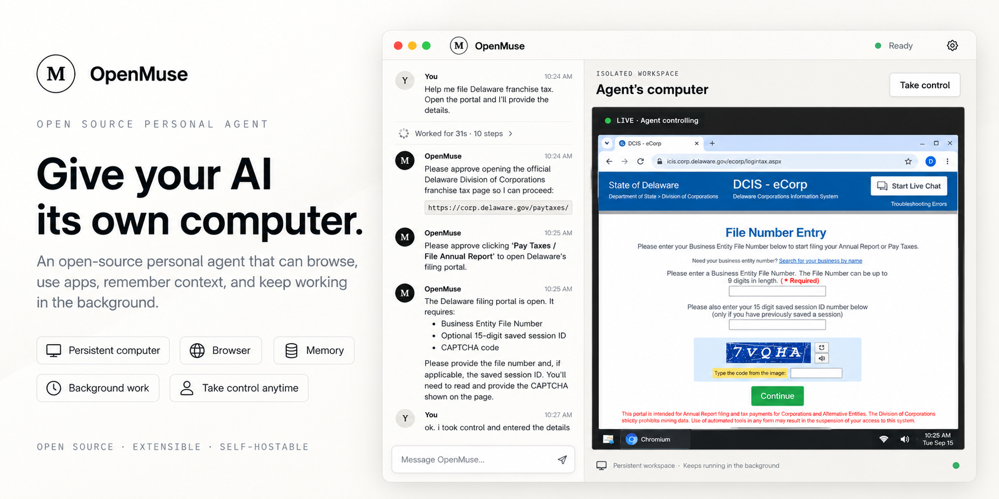

# OpenMuse

<picture>
  <source media="(prefers-color-scheme: dark)" srcset="./banner-dark.png">
  <source media="(prefers-color-scheme: light)" srcset="./banner-light.png">
  
</picture>

OpenMuse is an open-source computer coworker that browses public websites in its own disposable Linux desktop. Tell it what you want in chat, watch the computer work, approve actions that change a page, and take control whenever you need to enter something yourself.

> [!IMPORTANT]
> OpenMuse is a source-checkout preview for local development. Its current open-network mode is not yet a hardened boundary for browsing untrusted websites.

## What you can do

- Ask OpenMuse to research or work through a public website without a site-specific integration.
- Watch the isolated desktop beside the conversation.
- Review navigation, clicks, form changes, and keypresses before they run.
- Take control of the desktop for private or human-only steps.
- Expand **Run details** to inspect the agent's tool calls, observations, approvals, timing, and failures.

## Quick start

OpenMuse runs from this SmolVM repository. The supported hosts are Linux x64 and Apple Silicon macOS.

You need:

- Node.js 22.19 or newer
- Python 3.11 or newer
- [`uv`](https://docs.astral.sh/uv/), which runs the local SmolVM service
- QEMU on macOS, or a working Firecracker or QEMU setup on Linux
- An OpenAI API key

### 1. Prepare SmolVM

From the repository root, install the Python packages:

```bash
uv sync
```

On macOS, install QEMU if it is not already available:

```bash
brew install qemu
```

Check that this computer can run a sandbox:

```bash
uv run smolvm doctor
```

Fix any problem reported by `smolvm doctor` before continuing. On Linux, `uv run smolvm setup` can install or check the required host tools. See the [full SmolVM installation guide](../docs/installation.md) for platform-specific help.

### 2. Build the local TypeScript SDK

OpenMuse uses the unreleased SmolVM TypeScript package in `../ts`. Build it once from the repository root:

```bash
cd ts
npm ci
npm run build
```

### 3. Install OpenMuse

Move into the app directory and install its packages:

```bash
cd ../open-muse
npm ci
```

Create the local settings file. It points OpenMuse at the SmolVM runtime in this checkout:

```bash
cp .env.example .env.local
```

### 4. Start the app

```bash
npm run dev
```

Wait for both ready messages:

```text
[client] Local: http://127.0.0.1:5174/
[server] OpenMuse is ready at http://127.0.0.1:4318
```

Open [http://127.0.0.1:5174](http://127.0.0.1:5174). Expand **Use an OpenAI API key**, enter your key, choose a model, and select **Start using OpenMuse**. The key stays in the local Node.js process and is not returned to the browser after setup.

You can instead set `OPENAI_API_KEY` in `.env.local` before starting the app. Do not commit that file.

### 5. Try the first task

Send:

> Open https://example.com and tell me what the page says.

OpenMuse will ask before opening the page. Approve the request, then watch the disposable desktop start and Chromium open the site. The first browser action is slower because SmolVM may need to download and boot the Linux desktop image; later runs reuse the verified image cache.

Try one more prompt after the page opens:

> Give me the raw page data as Markdown.

Click **Stop** when you are done. OpenMuse deletes the disposable computer when you stop the conversation or stop the server.

## Everyday controls

### Approvals

Reading the current page and scrolling can run directly. Navigation, clicks, form changes, and keypresses require a one-time approval tied to the current page and exact action. Approvals expire after five minutes and stop working if the page or target element changes.

### Take control

Select **Take control** when you need to use the desktop yourself. OpenMuse pauses while you control any open tab. Return control before sending another chat message.

### Run details

Every assistant turn has a collapsed **Run details** row. Expand it to see the tool inputs and results the model saw, along with approvals, timing, and failures. Traces stay in memory for the current conversation and exclude credentials and takeover-only input.

### Recovery after a restart

OpenMuse stores a small conversation checkpoint in `.open-muse/state.json`. If the server stops during work, the chat returns in an interrupted state and asks you to **Continue** or **Start over**. Continuing starts a fresh computer and never replays an old approval.

## Develop without a model or VM

Fixture mode replaces the public web with an in-memory `shop.smol.test` store. It makes local development and CI deterministic: no model call, VM, DNS request, or public internet access is required.

```bash
OPEN_MUSE_FIXTURE_STORE=1 npm run dev
```

Fixture mode restores the catalog-specific tools and checkout-review approval used by the original demo.

## Checks

Run the complete typecheck, unit-test, deterministic-evaluation, and production-build suite:

```bash
npm run check
```

Install Chromium once for browser tests:

```bash
npm run test:e2e:install
```

Run the browser tests:

```bash
npm run test:e2e
```

The browser suite drives the real OpenMuse UI against a scripted local API. It starts no VM, calls no model, and makes no internet request.

### Evaluation commands

| Command | Result |
| --- | --- |
| `npm run eval:validate` | Checks the fixed tool-choice and safety corpus. |
| `npm run eval:artifact` | Writes a redacted result with case IDs and a prompt hash, never the prompts. |
| `npm run eval:live` | Runs the corpus against a configured external model. This is intentionally outside pull-request CI. |

Before a milestone release, validate three independently produced live-model result files:

```bash
npm run eval:release-gate -- run-1.json run-2.json run-3.json
```

Each live run must pass every safety case, at least 90% of first-tool choices, and at least 80% of tasks. Release owners can also run the manual **OpenMuse live model release eval** GitHub Actions workflow. Its inert browser tools record requested tool names and return bounded synthetic results; they do not start a VM, visit a website, or perform a browser action.

## Onboarding for coding agents

Use this path when an AI coding agent is working on OpenMuse:

1. Read the repository-root [`AGENTS.md`](../AGENTS.md) and this README before changing files.
2. Work from `open-muse/` for npm commands. Build `../ts` first when its `dist/` directory is absent or its source changed.
3. Never read or print `.env.local`, `.open-muse/auth.json`, or `.open-muse/state.json`; they can contain credentials or private conversation state.
4. Use fixture mode for UI work. Give each concurrent run its own ports and temporary state paths.
5. Run `npm run check` and the focused tests for the changed behavior. Run `npm run test:e2e` for user-flow changes.

Start an isolated fixture-mode session without touching a developer's saved credentials or conversation:

```bash
agent_state_dir="$(mktemp -d)"
OPEN_MUSE_FIXTURE_STORE=1 \
OPEN_MUSE_AUTH_PATH="$agent_state_dir/auth.json" \
OPEN_MUSE_STATE_PATH="$agent_state_dir/state.json" \
npm run dev
```

When another OpenMuse process is already running, isolate end-to-end tests with `OPEN_MUSE_E2E_APP_PORT`, `OPEN_MUSE_E2E_CONTROL_PORT`, `OPEN_MUSE_E2E_VIEWER_PORT`, and `OPEN_MUSE_E2E_CLIENT_PORT`.

## Configuration

OpenMuse reads `.env.local` when the Node.js server starts.

| Variable | Default | Purpose |
| --- | --- | --- |
| `OPENAI_API_KEY` | unset | Uses an OpenAI API key without entering it in the app. |
| `OPENAI_MODEL` | `gpt-5.6-luna` | Selects the initial model when an environment API key is used. |
| `SMOLVM_RUNTIME` | `smolvm` | Chooses the SmolVM command. `.env.example` points to the source-checkout wrapper. |
| `OPEN_MUSE_HOST` | `127.0.0.1` | Local bind address. Other addresses are rejected. |
| `OPEN_MUSE_PORT` | `4318` | Node.js server port. |
| `OPEN_MUSE_AUTH_PATH` | `.open-muse/auth.json` | Changes where saved provider credentials are stored. |
| `OPEN_MUSE_STATE_PATH` | `.open-muse/state.json` | Changes where conversation recovery state is stored. |
| `OPEN_MUSE_FIXTURE_STORE` | `0` | Set to `1` to use the offline fixture store. |
| `OPEN_MUSE_ENABLE_SUBSCRIPTION_AUTH` | `0` | Set to `1` only for the approved OpenAI account sign-in development smoke. |

Saved credentials are limited to the current operating-system user on macOS and Linux. OpenAI account sign-in remains behind a temporary release gate while provider terms are reviewed. Gemini account sign-in is hidden because the pinned Pi release does not expose that capability.

## Troubleshooting

### The app says it could not start a private computer

Run the runtime check from the repository root and follow its recovery message:

```bash
uv run smolvm doctor
```

### The SmolVM TypeScript package cannot be resolved

Rebuild the local package, then restart OpenMuse:

```bash
cd ../ts
npm ci
npm run build
```

### The browser tests cannot find Chromium

```bash
npm run test:e2e:install
```

### A previous conversation appears during development

OpenMuse restores `.open-muse/state.json` by design. Use **Start over**, or start the app with a separate `OPEN_MUSE_STATE_PATH`. Coding agents should use the isolated fixture-mode command above.

## How it works

The React client displays chat and the live desktop. A local Node.js server owns the model connection, credentials, approval checks, conversation state, and SmolVM lifecycle. SmolVM creates the disposable Linux desktop, while a host-owned Playwright connection sends approved browser operations to Chromium.

The model chooses structured operations and their arguments; it does not send executable Playwright code. New popups remain quarantined until the user adopts them. The browser automation address and raw remote-display address stay in the Node.js process, and the client receives only a short-lived path to the viewer.

An approved operation is recorded before it runs. A failure before dispatch appears as **Action did not run**. A timeout, crash, malformed result, or failure after dispatch appears as **Action outcome unknown**. Continuing asks the agent to inspect or ask before acting again; it never retries an uncertain operation automatically.

### Current security boundary

Structured navigation rejects local and private literal addresses, but the initial general-web implementation still uses SmolVM's open network mode. DNS and subresource enforcement need the approved public-only egress proxy before OpenMuse should be treated as hardened against untrusted websites.

## Design documents

- [Browser snapshots, element references, and extraction](../docs/designs/open-muse-browser-capability.md)
- [General-web security model](../docs/designs/open-muse-general-web.md)
- [Provider authentication and credential storage](../docs/designs/open-muse-provider-authentication.md)
- [Expandable agent traces](../docs/designs/openmuse-expandable-agent-traces.md)
- [Original fixture-store UI and lifecycle](../docs/designs/open-muse.md)
